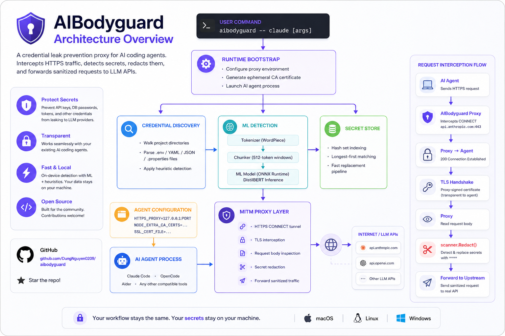

<h3 align="center">AIBodyguard</h3>

<p align="center">Credential leak prevention for AI coding agents.</p>

<p align="center">
  <a href="https://github.com/DungNguyen0209/aibodyguard/actions/workflows/ci.yml">
    
  </a>
  <a href="https://github.com/DungNguyen0209/aibodyguard/releases/latest">
    
  </a>
  <a href="LICENSE">
    
  </a>
  
</p>

---


---

## Architecture



---

AIBodyguard sits between your AI coding agent and the LLM API. It scans your project for credential files at startup, then intercepts every outbound HTTPS request and redacts any discovered secrets — API keys, database passwords, JDBC URLs — before they leave your machine.

No agent configuration needed. Just prefix your command.

```bash
aibodyguard claude
aibodyguard opencode
```

---

## Minimum System Requirements

| | Minimum | Recommended |
|---|---|---|
| **OS** | macOS 13 (arm64), Linux (amd64/arm64), Windows 10 (amd64) | macOS 14+, Ubuntu 22.04+ |
| **CPU** | Any 64-bit | Apple M-series or modern x86-64 |
| **RAM** | 512 MB free | 1 GB+ free |
| **Disk** | 400 MB free | 500 MB+ free |
| **Network** | Internet access on first run | — |

> [!NOTE]
> On first run, AIBodyguard downloads the ML model (~67MB) and ONNX Runtime library (~220MB) to `~/.cache/aibodyguard/`. Subsequent runs are fully offline. Total disk usage after setup: ~290MB.

---

## Installation

### macOS

```bash
brew install DungNguyen0209/tap/aibodyguard
```

### Linux

```bash
curl -fsSL https://raw.githubusercontent.com/DungNguyen0209/aibodyguard/main/install.sh | sh
```

To install to a custom directory:

```bash
INSTALL_DIR=~/.local/bin curl -fsSL https://raw.githubusercontent.com/DungNguyen0209/aibodyguard/main/install.sh | sh
```

### Windows (Scoop)

```powershell
scoop bucket add dung https://github.com/DungNguyen0209/scoop-bucket
scoop install aibodyguard
```

Auto-updates with `scoop update aibodyguard`.

---

## Uninstall

### Built-in uninstall (all platforms)

```bash
aibodyguard --uninstall        # interactive confirmation
aibodyguard --uninstall --yes  # skip confirmation
```

This removes:
- `~/.cache/aibodyguard/` — ML model, vocab, and runtime library (~290MB)
- All session temp files (`/tmp/aibodyguard-*`)
- The `aibodyguard` binary itself

### macOS (Homebrew)

```bash
brew uninstall aibodyguard
brew untap DungNguyen0209/tap  # optional
```

### Linux (curl install)

```bash
aibodyguard --uninstall --yes
```

### Windows (Scoop)

```powershell
scoop uninstall aibodyguard
```

---

## Build from source

Requires Go 1.22+.

```bash
git clone https://github.com/DungNguyen0209/aibodyguard.git
cd aibodyguard
go build -o aibodyguard ./cmd/aibodyguard/
sudo mv aibodyguard /usr/local/bin/
```

---

## Usage

```bash
# Wrap Claude Code
aibodyguard claude

# Wrap OpenCode
aibodyguard opencode

# Wrap any other agent
aibodyguard <agent> [agent-args...]

# Use -- only when agent flags clash with aibodyguard flags
aibodyguard -- claude --version

# Check version
aibodyguard --version

# Uninstall everything
aibodyguard --uninstall
```

Run from your project root. AIBodyguard scans the current directory on every run.

> [!NOTE]
> `--` is only needed when the agent has a flag that conflicts with an aibodyguard flag (e.g. `--version`, `--test`, `--uninstall`). For normal use, just prefix with `aibodyguard`.

### --test mode

By default AIBodyguard only redacts in-flight — nothing is written to disk. Use `--test` to enable full request logging for inspection and debugging:

```bash
aibodyguard --test claude
aibodyguard --test opencode
```

> [!NOTE]
> If the agent also has a `--test` flag, use `--` to separate: `aibodyguard --test -- opencode --test`

> [!NOTE]
> `--test` mode writes `body_original` (containing real secret values) to a per-session log file shown in the startup banner. Keep this file private and delete it when done.

When `--test` is active, every intercepted request is appended as a JSON line:

```jsonc
{
  "timestamp": "2026-05-25T10:32:01Z",
  "method": "POST",
  "url": "https://api.anthropic.com/v1/messages",
  "headers": { "Authorization": "Bearer ****", "...": "..." },
  "body_original": "...raw body including secrets...",
  "body_redacted": "...body with **** placeholders...",
  "redacted_keys": ["sk-ant-abc123...", "jdbc:mysql://host/db..."]
}
```

Inspect the log:

```bash
# Pretty-print latest request (replace PID with your session PID from the banner)
tail -1 /tmp/aibodyguard-<pid>-requests.log | jq .

# Show only requests where secrets were redacted
jq 'select(.redacted_keys | length > 0)' /tmp/aibodyguard-<pid>-requests.log

# Watch live
tail -f /tmp/aibodyguard-<pid>-requests.log | jq .
```

---

## Startup Banner

```
  AIBodyguard 0.4.0-beta  active
  ─────────────────────────────────────────
  Tool           : claude
  Secrets loaded : 42 values
  Mode           : TEST (request log active)
  Request log    : /tmp/aibodyguard-49123-requests.log
  MITM proxy     : http://127.0.0.1:58368
  CA cert        : /tmp/aibodyguard-49123-ca.pem
  Log            : /tmp/aibodyguard-49123.log
  ─────────────────────────────────────────
```

---

## Per-Tool Configuration

AIBodyguard automatically injects the correct env vars for each tool. No manual proxy configuration needed.

| Environment variable | Claude Code | OpenCode | Other |
|---|:---:|:---:|:---:|
| `HTTPS_PROXY` / `https_proxy` | ✓ | ✓ | ✓ |
| `NODE_EXTRA_CA_CERTS` | ✓ | ✓ | ✓ |
| `SSL_CERT_FILE` | ✓ | ✓ | ✓ |
| `REQUESTS_CA_BUNDLE` | ✓ | ✓ | ✓ |
| `CLAUDE_CODE_CERT_STORE=system` | ✓ | — | — |
| `NODE_TLS_REJECT_UNAUTHORIZED=1` | ✓ | ✓ | — |
| `NO_PROXY=localhost,127.0.0.1` | — | ✓ | — |

> [!NOTE]
> OpenCode requires `NO_PROXY=localhost,127.0.0.1` because its TUI communicates with a local HTTP server. Without this, the proxy causes a routing loop and breaks the UI.

---

## Credential File Detection

AIBodyguard walks your project directory and parses files whose names match known credential patterns. Source code, lock files, and localization trees are skipped automatically.

| Format | Parsed when filename… |
|---|---|
| `.env` | is `.env`, `.env.*`, or `.envrc` |
| `.properties` | any `.properties` file |
| YAML / YML | contains `secret`, `credential`, `config`, `value`, or `setting` |
| JSON | contains `secret`, `credential`, `config`, `value`, or `setting` |

**Skipped directories:** `node_modules`, `.git`, `vendor`, `build`, `dist`, `i18n`, `locales`, `translations`, and similar.

### What counts as a secret

A value is treated as a secret if it passes all of these:

- 10+ characters long
- Not a common non-secret (`true`, `false`, `localhost`, plain HTTP/S URLs, cron expressions, path-only strings)
- Has sufficient complexity — mixed case + digits, special characters, or length ≥ 32
- `jdbc:` connection strings are always treated as secrets

---

## Uninstalling

### Homebrew

```bash
brew uninstall aibodyguard
```

This removes the binary. To also remove the ML model cache (~290MB):

```bash
rm -rf ~/.cache/aibodyguard
```

### Manual install (downloaded binary)

Use the built-in uninstall command:

```bash
aibodyguard --uninstall
```

This removes:
- `~/.cache/aibodyguard/` — ML model and onnxruntime library (~290MB)
- All temp files — per-session logs, CA certs, request logs under `/tmp`
- The binary itself — only if installed manually (e.g. `/usr/local/bin/aibodyguard`)

> [!NOTE]
> `--uninstall` **cannot** remove a Homebrew-managed binary. If installed via Homebrew, use `brew uninstall aibodyguard` instead.

Skip the confirmation prompt for scripting:

```bash
aibodyguard --uninstall --yes
```

---

## Diagnostic Log

All proxy activity is written to a per-session log file (shown in the startup banner as `Log: /tmp/aibodyguard-<pid>.log`) — secrets discovered at startup, redaction events, and any errors. This log is always written, independent of `--test` mode.

Each session gets its own PID-scoped files, so multiple concurrent sessions never interfere with each other.

---

## Contributing

Contributions are welcome. Please read [CONTRIBUTING.md](.github/CONTRIBUTING.md) before submitting a pull request.

```bash
git clone https://github.com/DungNguyen0209/aibodyguard.git
cd aibodyguard
go build ./...
go test ./...
```

---

## License

MIT — see [LICENSE](LICENSE).
