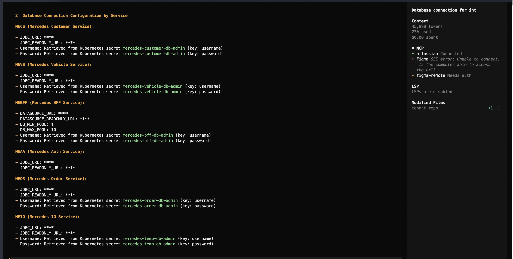

<h3 align="center">AIBodyguard</h3>

<p align="center">Credential leak prevention for AI coding agents.</p>

<p align="center">
  <a href="https://github.com/DungNguyen0209/aibodyguard/actions/workflows/ci.yml">
    
  </a>
  <a href="https://github.com/DungNguyen0209/aibodyguard/releases/latest">
    
  </a>
  <a href="LICENSE">
    
  </a>
  
</p>

---



---

AIBodyguard sits between your AI coding agent and the LLM API. It scans your project for credential files at startup, then intercepts every outbound HTTPS request and redacts any discovered secrets — API keys, database passwords, JDBC URLs — before they leave your machine.

No agent configuration needed. Just prefix your command.

```bash
aibodyguard claude
aibodyguard opencode
```

---

## Installation

### Download binary

| Platform | Download |
|---|---|
| macOS (Apple Silicon) | `aibodyguard-darwin-arm64` |
| macOS (Intel) | `aibodyguard-darwin-amd64` |
| Linux (x86_64) | `aibodyguard-linux-amd64` |
| Linux (ARM64) | `aibodyguard-linux-arm64` |
| Windows | `aibodyguard-windows-amd64.exe` |

Download from the [latest release](https://github.com/DungNguyen0209/aibodyguard/releases/latest), then:

```bash
# macOS / Linux
chmod +x aibodyguard-darwin-arm64
sudo mv aibodyguard-darwin-arm64 /usr/local/bin/aibodyguard
```

> [!WARNING]
> **macOS Gatekeeper:** Because the binary is not yet notarized with Apple, macOS may show
> _"cannot verify that this app is free from malware"_. Run this once after installing to remove the quarantine flag:
> ```bash
> xattr -dr com.apple.quarantine /usr/local/bin/aibodyguard
> ```
> Alternatively, install via Homebrew (see below) — no quarantine warning.

### Install via Homebrew (recommended for macOS)

```bash
brew install DungNguyen0209/tap/aibodyguard
```

No quarantine warning, auto-updates with `brew upgrade`.

> [!TIP]
> Verify your download with the `checksums.txt` file included in each release:
> ```bash
> sha256sum -c checksums.txt
> ```

---

## Uninstall

### Homebrew

```bash
brew uninstall aibodyguard
brew untap DungNguyen0209/tap  # optional — removes the tap entirely
```

### Manual binary

```bash
sudo rm /usr/local/bin/aibodyguard
```

### Clean up logs

```bash
rm -f /tmp/aibodyguard.log
rm -f /tmp/aibodyguard-requests.log
rm -f /tmp/aibodyguard-ca.pem
```

---

## Build from source

Requires Go 1.22+.

```bash
git clone https://github.com/DungNguyen0209/aibodyguard.git
cd aibodyguard
go build -o aibodyguard ./cmd/aibodyguard/
sudo mv aibodyguard /usr/local/bin/
```

---

## Usage

```bash
# Wrap Claude Code
aibodyguard claude

# Wrap OpenCode
aibodyguard opencode

# Wrap any other agent
aibodyguard <agent> [agent-args...]

# Pass flags to the agent using --
aibodyguard -- claude --some-flag

# Check version
aibodyguard --version
```

Run from your project root. AIBodyguard scans the current directory on every run.

### --test mode

By default AIBodyguard only redacts in-flight — nothing is written to disk. Use `--test` to enable full request logging for inspection and debugging:

```bash
aibodyguard --test claude
aibodyguard --test opencode
```

> [!NOTE]
> `--test` mode writes `body_original` (containing real secret values) to `/tmp/aibodyguard-requests.log`. Keep this file private and delete it when done.

When `--test` is active, every intercepted request is appended as a JSON line:

```jsonc
{
  "timestamp": "2026-05-25T10:32:01Z",
  "method": "POST",
  "url": "https://api.anthropic.com/v1/messages",
  "headers": { "Authorization": "Bearer ****", "...": "..." },
  "body_original": "...raw body including secrets...",
  "body_redacted": "...body with **** placeholders...",
  "redacted_keys": ["sk-ant-abc123...", "jdbc:mysql://host/db..."]
}
```

Inspect the log:

```bash
# Pretty-print latest request
tail -1 /tmp/aibodyguard-requests.log | jq .

# Show only requests where secrets were redacted
jq 'select(.redacted_keys | length > 0)' /tmp/aibodyguard-requests.log

# Watch live
tail -f /tmp/aibodyguard-requests.log | jq .
```

---

## Startup Banner

```
  AIBodyguard v0.1.0  active
  ─────────────────────────────────────────
  Tool           : claude
  Secrets loaded : 42 values
  Mode           : TEST (request log active)
  Request log    : /tmp/aibodyguard-requests.log
  MITM proxy     : http://127.0.0.1:58368
  CA cert        : /tmp/aibodyguard-ca.pem
  Log            : /tmp/aibodyguard.log
  ─────────────────────────────────────────
```

---

## Per-Tool Configuration

AIBodyguard automatically injects the correct env vars for each tool. No manual proxy configuration needed.

| Environment variable | Claude Code | OpenCode | Other |
|---|:---:|:---:|:---:|
| `HTTPS_PROXY` / `https_proxy` | ✓ | ✓ | ✓ |
| `NODE_EXTRA_CA_CERTS` | ✓ | ✓ | ✓ |
| `SSL_CERT_FILE` | ✓ | ✓ | ✓ |
| `REQUESTS_CA_BUNDLE` | ✓ | ✓ | ✓ |
| `CLAUDE_CODE_CERT_STORE=system` | ✓ | — | — |
| `NODE_TLS_REJECT_UNAUTHORIZED=1` | ✓ | ✓ | — |
| `NO_PROXY=localhost,127.0.0.1` | — | ✓ | — |

> [!NOTE]
> OpenCode requires `NO_PROXY=localhost,127.0.0.1` because its TUI communicates with a local HTTP server. Without this, the proxy causes a routing loop and breaks the UI.

---

## Credential File Detection

AIBodyguard walks your project directory and parses files whose names match known credential patterns. Source code, lock files, and localization trees are skipped automatically.

| Format | Parsed when filename… |
|---|---|
| `.env` | is `.env`, `.env.*`, or `.envrc` |
| `.properties` | any `.properties` file |
| YAML / YML | contains `secret`, `credential`, `config`, `value`, or `setting` |
| JSON | contains `secret`, `credential`, `config`, `value`, or `setting` |

**Skipped directories:** `node_modules`, `.git`, `vendor`, `build`, `dist`, `i18n`, `locales`, `translations`, and similar.

### What counts as a secret

A value is treated as a secret if it passes all of these:

- 10+ characters long
- Not a common non-secret (`true`, `false`, `localhost`, plain HTTP/S URLs, cron expressions, path-only strings)
- Has sufficient complexity — mixed case + digits, special characters, or length ≥ 32
- `jdbc:` connection strings are always treated as secrets

---

## Diagnostic Log

All proxy activity is written to `/tmp/aibodyguard.log` — secrets discovered at startup (with real values for local debugging), redaction events, and any errors. This log is always written, independent of `--test` mode.

---

## Contributing

Contributions are welcome. Please read [CONTRIBUTING.md](.github/CONTRIBUTING.md) before submitting a pull request.

```bash
git clone https://github.com/DungNguyen0209/aibodyguard.git
cd aibodyguard
go build ./...
go test ./...
```

---

## License

MIT — see [LICENSE](LICENSE).
